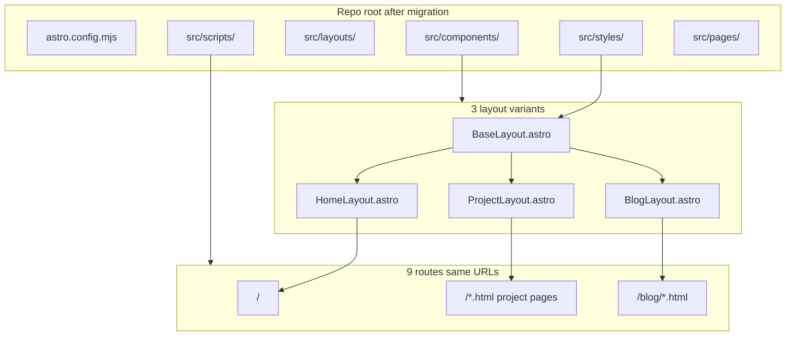

# Portfolio to Astro Migration Plan

## Current state

**Existing site (root):** 9 self-contained static HTML pages (~5,700 lines total) using Tailwind v4 CDN, inline `@theme` tokens, and vanilla JS. No build step, no local assets.

| Page | Lines | Layout width |
|------|-------|--------------|
| [index.html](index.html) | 602 | `max-w-4xl` |
| [nuvelco-cca.html](nuvelco-cca.html) | 561 | `max-w-6xl` |
| [start-pos.html](start-pos.html) | 869 | `max-w-6xl` |
| [overlay-manager.html](overlay-manager.html) | 523 | `max-w-6xl` (cyan accent override) |
| 4 blog posts in [blog/](blog/) | 580–703 each | `max-w-3xl` |

**Astro scaffold ([astro/](astro/)):** Default Basics starter — boilerplate only. You chose to **move Astro to repo root** (no `astro/` subfolder).

## Target architecture



## Phase 1 — Move Astro to root and configure tooling

1. **Relocate scaffold files** from [astro/](astro/) to repo root:
   - `astro.config.mjs`, `package.json`, `pnpm-lock.yaml`, `tsconfig.json`, `.gitignore`, `public/`, `src/`
   - Keep [.vscode/settings.json](.vscode/settings.json) at root (merge Live Server port if useful)
   - Delete empty `astro/` folder and default boilerplate ([src/components/Welcome.astro](astro/src/components/Welcome.astro), starter assets)

2. **Remove legacy HTML** once Astro equivalents exist (same commit batch):
   - `index.html`, `nuvelco-cca.html`, `start-pos.html`, `overlay-manager.html`, `blog/*.html`

3. **Install Tailwind v4 via Vite plugin** (matches current `@theme` approach, no CDN):

```js
// astro.config.mjs
import { defineConfig } from 'astro/config';
import tailwindcss from '@tailwindcss/vite';

export default defineConfig({
  site: 'https://rrlopez.github.io',
  vite: { plugins: [tailwindcss()] },
});
```

Dependencies: `tailwindcss`, `@tailwindcss/vite`, `vite ^8.0.0` (peer for Astro 7).

4. **Add GitHub Actions deploy** (`.github/workflows/deploy.yml`):
   - Trigger on push to `main`
   - `pnpm install && pnpm build` at repo root
   - Deploy `dist/` via `actions/upload-pages-artifact` + `actions/deploy-pages`
   - Enable GitHub Pages source = GitHub Actions in repo settings (one-time manual step)

## Phase 2 — Preserve design system in shared CSS

Extract duplicated inline `<style type="text/tailwindcss">` blocks into layered stylesheets imported once in [BaseLayout.astro](astro/src/layouts/Layout.astro):

| File | Contents (copied verbatim from current HTML) |
|------|-----------------------------------------------|
| `src/styles/global.css` | `@import "tailwindcss"`, base `@theme` tokens, `html/body`, `.pulse-dot`, reduced-motion, scroll behavior |
| `src/styles/home.css` | Full `@media print` resume rules from [index.html](index.html) (~100 lines) |
| `src/styles/project.css` | `.reveal`, `.shot`, `.flow-line`, warn/danger tokens, project print rules |
| `src/styles/blog.css` | `.code-block`, `.token-*`, `.prose-inline`, blog print rules |
| `src/styles/overlay-manager.css` | Cyan/blue `@theme` override for overlay-manager page only |

**UI parity rule:** Keep all Tailwind utility classes on elements unchanged during migration — only move `<head>` shell, nav, and repeated chrome into layouts/components.

## Phase 3 — Shared Astro components and layouts

### Layouts

- **`BaseLayout.astro`** — `<html>`, charset, viewport, `<title>`, meta description, global CSS imports, `<body class="bg-bg text-text ...">`, `<slot />`
- **`HomeLayout.astro`** — extends Base; includes home nav + print resume button; container `max-w-4xl`
- **`ProjectLayout.astro`** — props: `title`, `description`, `navLinks[]`, optional `themeClass`; container `max-w-6xl`; tech-strip slot
- **`BlogLayout.astro`** — props: `title`, `description`, `relatedProject?`; container `max-w-3xl`; blog nav (“← All posts” → `/#blog`)

### Reusable components

| Component | Source pattern |
|-----------|----------------|
| `ScrollToTop.astro` | Identical button + scroll listener (all 9 pages) |
| `NavHome.astro` | Sticky nav from [index.html](index.html) lines 166–186 |
| `NavProject.astro` | Project/blog nav with “Back to Portfolio” |
| `Footer.astro` | Per-page footer markup (extract as-is from each template) |

### Client scripts (`src/scripts/`, loaded with `is:inline` or default `<script>` where DOM-dependent)

| Script | Used on |
|--------|---------|
| `scroll-to-top.ts` | All pages |
| `reveal.ts` | Project pages, blog posts, overlay-manager (`IntersectionObserver` on `.reveal`) |
| `offline-demo.ts` | [start-pos.html](start-pos.html), [nuvelco-cca.html](nuvelco-cca.html) |
| `overlay-sandbox.ts` | [overlay-manager.html](overlay-manager.html) — full modal demo |
| `copy-install.ts` | overlay-manager clipboard handler |

Use `is:inline` for scripts that must run exactly as today (overlay sandbox, offline demo) to avoid bundling surprises.

## Phase 4 — Migrate pages (preserve URLs)

Use Astro’s `.html.astro` naming so built URLs match existing links:

| Astro page | Output URL |
|------------|------------|
| `src/pages/index.astro` | `/` |
| `src/pages/nuvelco-cca.html.astro` | `/nuvelco-cca.html` |
| `src/pages/start-pos.html.astro` | `/start-pos.html` |
| `src/pages/overlay-manager.html.astro` | `/overlay-manager.html` |
| `src/pages/blog/offline-app-shell.html.astro` | `/blog/offline-app-shell.html` |
| `src/pages/blog/offline-auth-engine.html.astro` | `/blog/offline-auth-engine.html` |
| `src/pages/blog/making-db-closer-to-app.html.astro` | `/blog/making-db-closer-to-app.html` |
| `src/pages/blog/overlay-manager-deep-dive.html.astro` | `/blog/overlay-manager-deep-dive.html` |

**Migration method per page:**
1. Copy `<main>` body sections from existing HTML into the `.astro` page
2. Wrap in the correct layout
3. Move page-specific `<script>` blocks to dedicated script files or inline scripts at bottom
4. Keep all `href`, `id`, `class`, inline SVG, and `placehold.co` image URLs identical
5. Update internal links only where needed (`index.html` → `/`, `index.html#blog` → `/#blog`) — Astro-friendly but same visible routes

**Highest-complexity pages (migrate last, test carefully):**
- [start-pos.html](start-pos.html) — offline sync simulator + live demo block
- [overlay-manager.html](overlay-manager.html) — modal sandbox + copy button
- Blog posts — large syntax-highlighted `<pre>` blocks (keep HTML structure, no MDX conversion yet)

## Phase 5 — Verification checklist

Run locally after each page group:

```bash
pnpm dev    # visual compare at localhost:4321
pnpm build  # confirm 9 routes in dist/
pnpm preview
```

Compare against current site for:

- [ ] Dark theme colors and hover states (cards, nav, pills)
- [ ] Sticky nav + smooth scroll + `scroll-mt-16` section offsets
- [ ] Scroll-to-top button appears after 400px
- [ ] `.reveal` fade-up on project/blog pages
- [ ] Print resume from homepage (`window.print()` + print CSS)
- [ ] Offline demo toggle on START POS / NUVELCO pages
- [ ] Overlay manager live modal sandbox + npm copy
- [ ] All 9 URLs resolve with `.html` suffix where applicable
- [ ] Mobile nav (`hidden md:flex` links) unchanged

## File tree after migration

```
rrlopez.github.io/
├── .github/workflows/deploy.yml
├── astro.config.mjs
├── package.json
├── public/
├── src/
│   ├── components/     # Nav, ScrollToTop, Footer
│   ├── layouts/        # Base, Home, Project, Blog
│   ├── pages/          # index + 3 projects + 4 blog (.html.astro)
│   ├── scripts/        # Client interactivity
│   └── styles/         # global, home, project, blog, overlay-manager
└── tsconfig.json
```

## Out of scope (can follow later)

- Converting blog posts to MDX/content collections
- Replacing `placehold.co` with local images
- Adding favicon/branding beyond current placeholders
- SEO enhancements beyond existing meta tags

## Risk mitigation

- **URL breakage:** `.html.astro` filenames + unchanged `href` paths
- **Tailwind class drift:** Do not refactor markup; literal copy from HTML
- **Script regressions:** Keep overlay/offline scripts inline initially; extract only after visual parity confirmed
- **Print layout:** Homepage print CSS is the most fragile piece — verify in browser print preview before deleting old `index.html`
